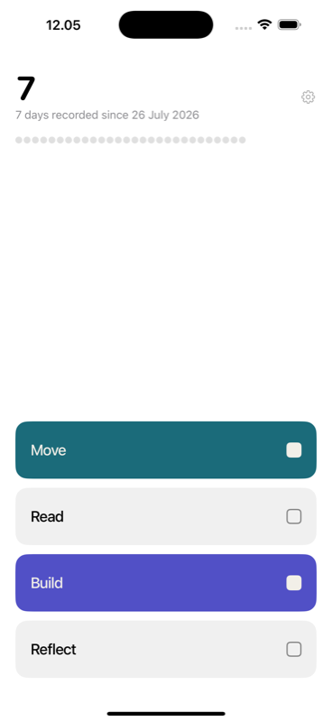
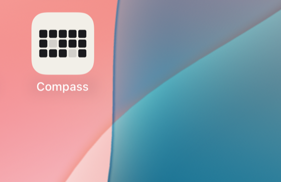
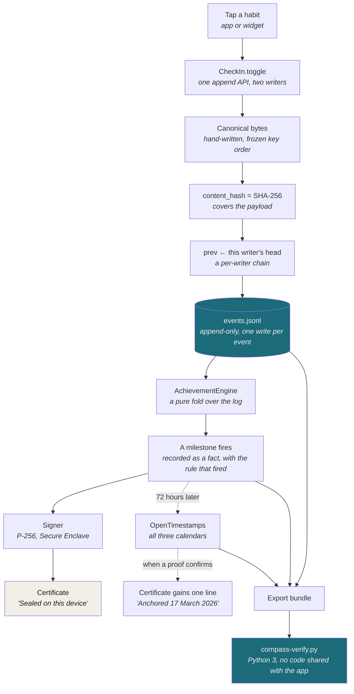
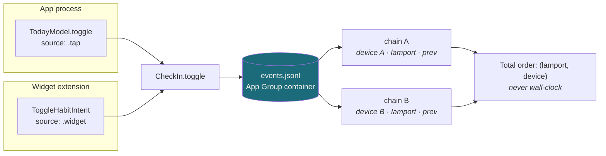
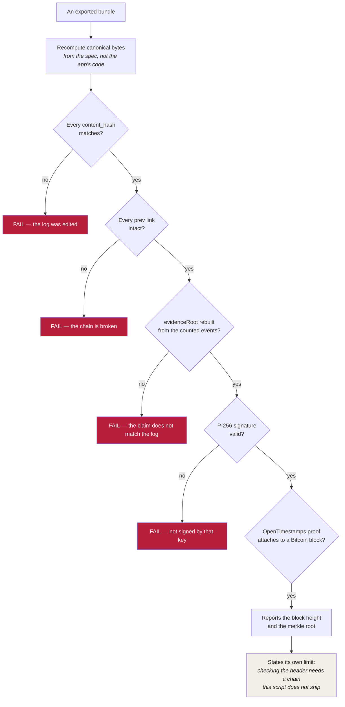

# Compass at a glance

A habit tracker that produces a record of what you actually did, which you can
hand to a stranger and they can check without trusting you or the app.

| The daily loop | On the home screen |
|---|---|
|  |  |

Both are the real app on a simulator, not mockups. The left screen is a week of
actual data. The number is **total days recorded**, never the current streak —
a number that resets to zero teaches you to start over, and starting over is the
behaviour this project was built against.

The icon is fifteen struck cells, three by five, with two not made. It is
deliberately pale and low-chroma: almost every other icon on a home screen is a
saturated ground with a white glyph, so the odd one out is the easiest thing on
the page to find.

---

## From a tap to something a stranger can check

Nothing on the launch path touches the network. The tap is three synchronous
steps and one `write(2)`; everything else happens after the pixel has already
changed.

---

## Two writers, one log

The app and the Home Screen widget are separate processes. They are treated as
two independent writers rather than pretending to be one.

Each writer has its own UUID, its own `lamport` counter and its own `prev`
chain, so `logHeads` carries two heads for one phone. They share the append API
because if they wrote through different paths the chains would diverge — and
the two-writer test found a real defect the day it was written.

---

## What the verifier actually checks

`verifier/compass-verify.py` is Python 3, standard library only, and shares no
code with the app. That independence is the point: a verifier that imported the
app's encoder would only prove the app agrees with itself.

It was estimated at ~200 lines and came out at 579, because re-deriving the
claim from the log and doing P-256 by hand were not in the estimate.

---

## What is deliberately absent

No accounts, no server, no sign-in, no notifications, no gamification, no
streak headline, no social layer, and nothing the user must understand about
blockchains — no wallet, no gas, no chain name, no address, and never the word
"mint". Each of those is a written non-goal with a stated reason in
[product.md](product.md), and the non-goals win over every other document in
this repository.

The one operational dependency, named rather than hidden: the OpenTimestamps
calendars are somebody else's servers. If they vanish during the window, pending
proofs are lost — the local signature survives and the app keeps working. See
[adr/0004](adr/0004-what-goes-on-chain.md).
